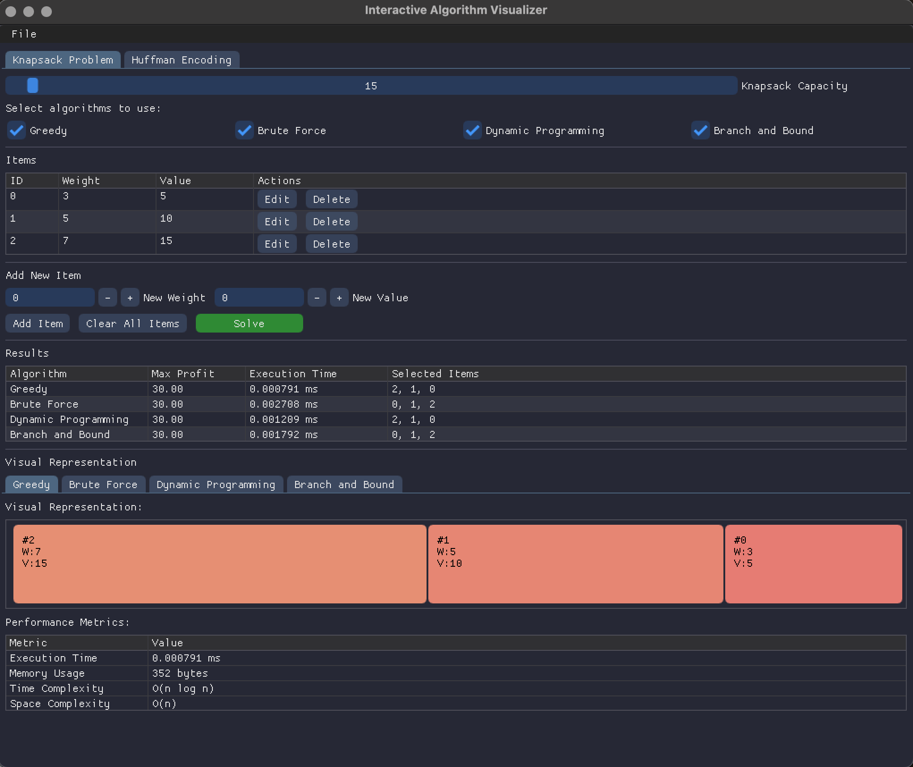
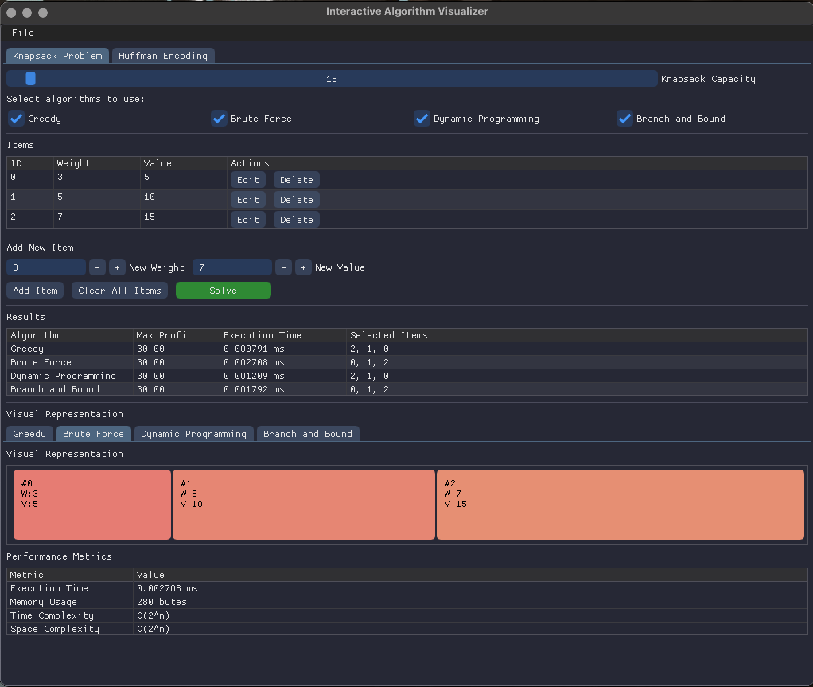
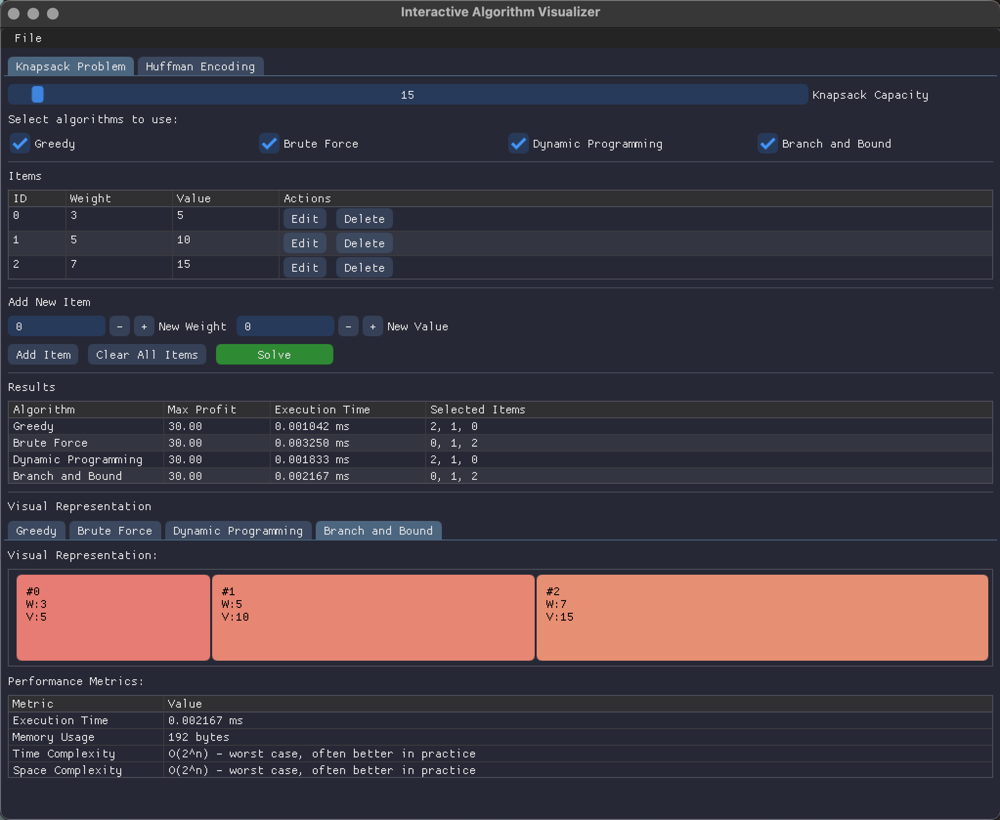
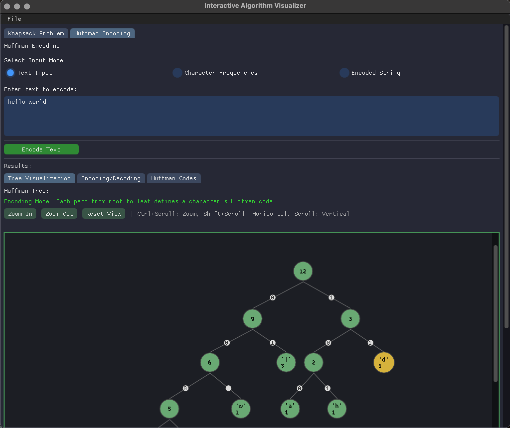
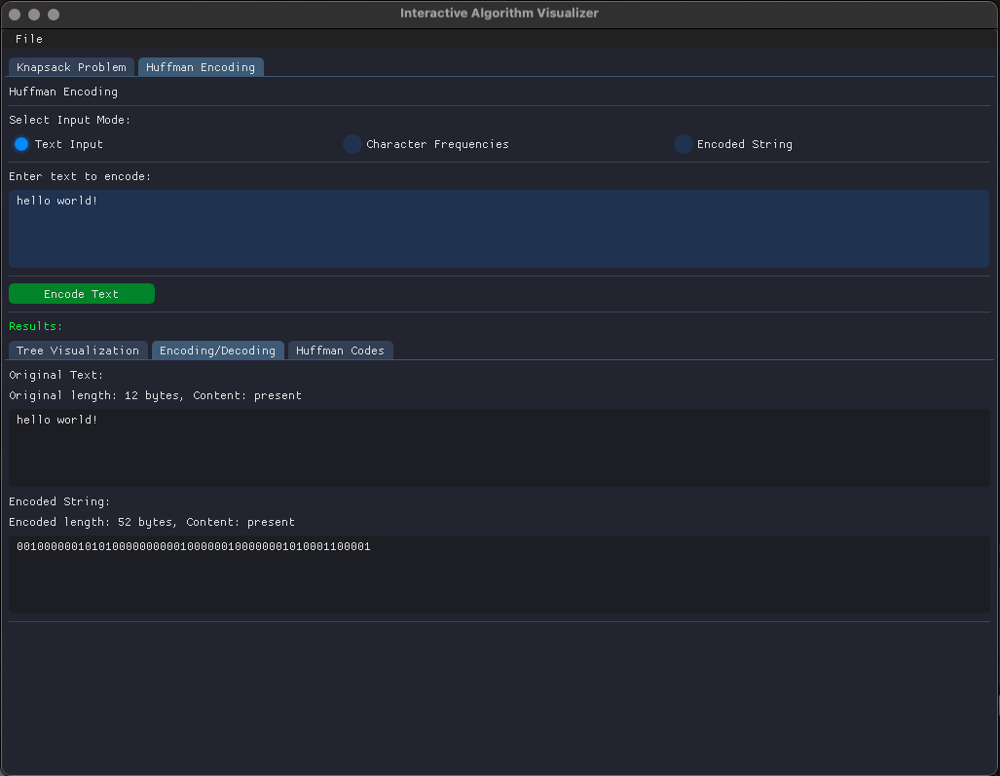
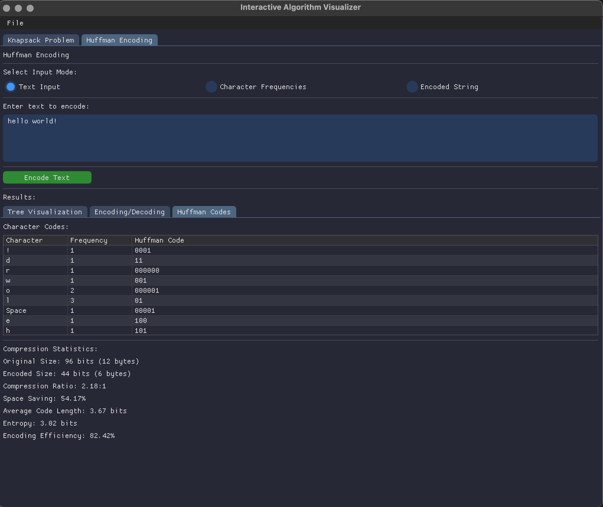
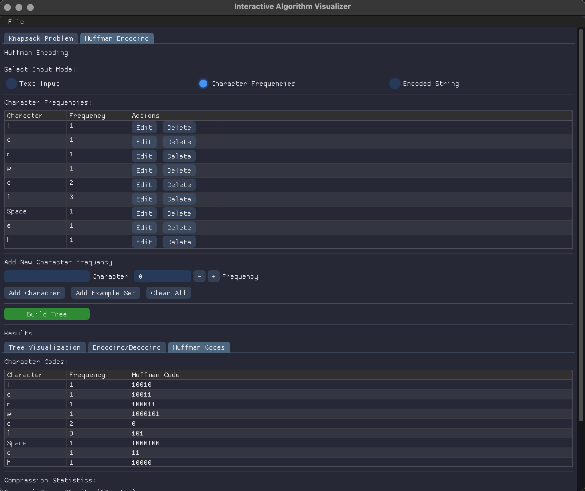
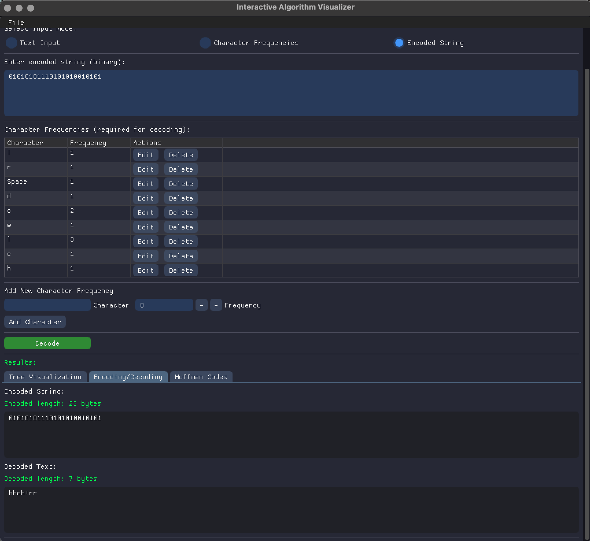

# Interactive Knapsack Planner

An interactive algorithm visualizer featuring the knapsack problem solver and Huffman encoding with a graphical user interface built using SFML 3.0 and Dear ImGui.

## Knapsack Problem Visualizations

<p align="center">
  
  
</p>
<p align="center">
  <video src="images/knapsack/knapsack_dp_trace.mov" width="400" controls alt="Knapsack Solver DP Table Visualization"></video>
  
</p>

## Huffman Encoding Visualizations

<p align="center">
  
  
</p>
<p align="center">
  
  
  
</p>

## Project Overview:

This application provides an interactive way to visualize and understand two important computer science algorithms:

1. **0/1 Knapsack Problem (Optimization Algorithm)**: Optimize selection of items with different weights and values to maximize profit while respecting weight capacity constraints.
   A classic problem in combinatorial optimization, where the goal is to select the most valuable subset of items without exceeding a fixed weight capacity. Each item has a specific weight and value, and the application supports multiple strategies to solve it:

- Greedy: Quick but non-optimal, based on value-to-weight ratio.
- Brute Force: Explores all possible subsets to guarantee the optimal solution (only feasible for small inputs).
- Dynamic Programming: Efficient solution with time complexity O(nW), where n is the number of items and W is the capacity.
- Branch and Bound: Prunes the solution tree using bounds to improve efficiency on large input sizes.

2. **Huffman Encoding**: Lossless data compression algorithm that creates variable-length prefix codes based on the frequency of symbols.The result is a set of variable-length prefix codes that reduce the total number of bits needed for encoding.

## Features:

The application features real-time visualization, step-by-step animation, and performance metrics to help understand these algorithms.

### Knapsack:

- DP table visualization for dynamic programming
- Execution time and memory usage stats
- Traceback of selected items
- Side-by-side comparison of different methods

### Huffman:

- Visual construction of the Huffman Tree
- Bit-by-bit encoded output display
- Live decoding and encoding verification
- Frequency analysis of characters
- Display of final symbol-to-binary code map

## Why use this application?

This tool transforms abstract algorithmic logic into interactive, visual experiences. Users can:

- Step through algorithm execution visually
- Understand algorithm trade-offs (speed, memory, accuracy)
- Learn through experimentation with custom inputs
- Evaluate real-world applications of optimization and compression

## Prerequisites

### Required Software

- **CMake** (version 3.12 or higher)
- **C++ Compiler** with C++17 support
- **SFML 3.0** (Simple and Fast Multimedia Library)

### Install SFML 3.0

#### macOS

```bash
brew install sfml
```

#### Ubuntu/Debian

```bash
# SFML 3.0 may not be in official repositories yet, you might need to build from source:
# https://github.com/SFML/SFML/wiki/SFML-3:-Preparing-and-building

# For older SFML versions:
# sudo apt-get install libsfml-dev
```

#### Windows with MSYS2

```bash
pacman -S mingw-w64-x86_64-sfml
```

#### Windows (Direct Installation)

1. Download SFML 3.0 from the [official website](https://www.sfml-dev.org/download.php)
2. Extract to `E:/Libraries/SFML-3.0.0` (or modify the CMakeLists.txt with your preferred location)

### ImGui

ImGui will be automatically downloaded when you run the build script.

## Building and Running

### Quick Start (Recommended)

Run the build script which handles all dependencies, compilation, and execution:

```bash
./build_and_run.sh
```

For a clean build:

```bash
./build_and_run.sh --clean
```

For a debug build:

```bash
./build_and_run.sh --debug
```

### Manual Build Process

1. Clone the repository:

```bash
git clone https://github.com/yourusername/interactive-knapsack-planner.git
cd interactive-knapsack-planner
```

2. Create a build directory:

```bash
mkdir build && cd build
```

3. Configure with CMake:

```bash
cmake ..
```

4. Build the project:

```bash
cmake --build .
```

5. Run the application:

```bash
./bin/knapsack_main
```

## Project Structure

```bash
interactive-knapsack-planner/
├── backend/
│   ├── include/
│   │   ├── gui/           # GUI component headers
│   │   ├── huffman/       # Huffman encoding headers
│   │   └── knapsack/      # Knapsack algorithm headers
│   ├── src/
│   │   ├── gui/           # GUI component implementations
│   │   ├── huffman/       # Huffman encoding implementations
│   │   └── knapsack/      # Knapsack algorithm implementations
│   ├── CMakeLists.txt     # Backend build configuration
│   ├── config.h.in        # Configuration template
│   └── main.cpp           # Main application entry point
├── external/              # External libraries (ImGui, etc.)
├── scripts/               # Build and setup scripts
├── .gitignore
├── build_and_run.sh       # Main build script
├── CMakeLists.txt         # Root build configuration
└── README.md              # This file
```

## Features and Components

### Knapsack Problem Solver

The application implements four different algorithms for solving the knapsack problem:

- **Greedy Approach**: Sort items by profit-to-weight ratio (fast but suboptimal)
- **Brute Force**: Examine all possible combinations (optimal but exponential complexity)
- **Dynamic Programming**: Efficient solution with optimal results (polynomial complexity)
- **Branch and Bound**: Uses bounds to prune search space (exponential worst case, but often faster in practice)

Key files:

- `backend/include/knapsack/knapsack_solver.hpp` - Main solver interface
- `backend/include/knapsack/greedy_knapsack.hpp` - Greedy algorithm
- `backend/include/knapsack/brute_force_knapsack.hpp` - Brute force algorithm
- `backend/include/knapsack/dp_knapsack.hpp` - Dynamic programming algorithm
- `backend/include/knapsack/branchbound.hpp` - Branch and bound algorithm

### Huffman Encoding

Interactive visualization of Huffman encoding and decoding:

- Build and visualize Huffman trees
- Encode text to binary representation
- Decode binary back to text
- Display compression statistics

Key files:

- `backend/include/huffman/huffmantree.hpp` - Huffman tree implementation
- `backend/include/huffman/node.hpp` - Tree node structure
- `backend/src/gui/huffman_gui.cpp` - GUI for Huffman encoding

### GUI Components

The application uses Dear ImGui with SFML for rendering:

- `backend/include/gui/gui_app.hpp` - Main application GUI
- `backend/include/gui/imgui_sfml_bridge.hpp` - Bridge between ImGui and SFML
- `backend/include/gui/knapsack_gui.hpp` - Knapsack problem GUI
- `backend/include/gui/huffman_gui.hpp` - Huffman encoding GUI

## Using the Application

### Knapsack Solver Tab

1. Set the knapsack capacity using the slider
2. Add items with weights and values
3. Select which algorithms to run
4. Click "Solve" to see the results
5. View detailed performance metrics and visual representation of solutions

### Huffman Encoding Tab

1. Choose input mode (Text, Character Frequencies, or Encoded String)
2. Enter data according to selected mode
3. Click "Encode Text", "Build Tree", or "Decode" button
4. Explore the Huffman tree visualization, encoding/decoding results, and compression statistics

## Performance Metrics

Both algorithms provide detailed performance metrics:

- Execution time in milliseconds
- Memory usage
- Time complexity analysis
- Space complexity analysis

## Build System

The project uses CMake for cross-platform building:

- `CMakeLists.txt` - Root build configuration
- `backend/CMakeLists.txt` - Backend library configuration
- `build_and_run.sh` - Automated build script with platform detection

## Contributing

Contributions are welcome! Please feel free to submit a Pull Request.

## License

[Your license information]

## Acknowledgments

- Dear ImGui: https://github.com/ocornut/imgui
- SFML: https://www.sfml-dev.org/
